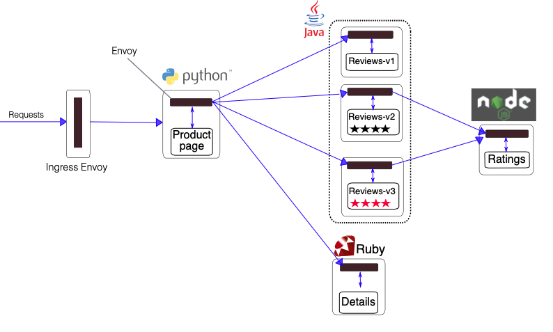

# Introduction 

This workshop basically follows [Istio Docs](https://istio.io/docs/) (v1.2.2).


# Prerequisite

We use minikube as the kubernetes cluster for this workshop, please follow these steps to
-  [install kubectl](https://kubernetes.io/docs/tasks/tools/install-kubectl/)
-  [install hypervisor](https://minikube.sigs.k8s.io/docs/reference/drivers/)
-  [install minikube](https://minikube.sigs.k8s.io/docs/start/)
    
```
# start minikube, please change value for vm-driver based on hypervisor that you use,
# the following we use 'virtualbox'

minikube start \
  --memory=16384 --cpus=4 \
  --kubernetes-version=v1.12.8 \
  --extra-config=controller-manager.cluster-signing-cert-file="/var/lib/minikube/certs/ca.crt" \
  --extra-config=controller-manager.cluster-signing-key-file="/var/lib/minikube/certs/ca.key" \
  --extra-config=apiserver.service-node-port-range=80-30000 \
  --vm-driver=virtualbox
```


# Installation

### 0.0) Istio

```
# create a namespace "istio-system", inside we install 'istio' along with its 'addons'
./istio-install.sh

# to ensure all Istio pods are deployed and have a status of Running
# please note that this process may take a few minutes ...
kubectl get pods --namespace istio-system
```

### 1.0) bookinfo-application

```
# deploy 'bookinfo'
kubectl apply -f 1.0--bookinfo-application/

# to verify all 'bookinfo' pods are running
kubectl get pods --namespace default

# append /etc/hosts for 'bookinfo' service
echo $(minikube ip) localhost-bookinfo.example.com | sudo tee -a /etc/hosts

# open your favorite web browser to visit 'bookinfo ui'
open http://localhost-bookinfo.example.com/productpage
```


https://istio.io/docs/examples/bookinfo/

---

# Tasks

### 2.0) traffic-management

#### 2.1) request-routing

```
# route 100% of traffic to 'v1' for all services
kubectl apply -f 2.0--traffic-management/virtual-service-all-v1.yaml

# route traffic to 'reviews-v2' if signed in as 'jason'
kubectl apply -f 2.0--traffic-management/2.1--request-routing/virtual-service-reviews-test-v2.yaml

# cleanup
kubectl delete -f 2.0--traffic-management/virtual-service-all-v1.yaml
```

#### 2.2) traffic-shifting

```
# route 100% of traffic to 'v1' for all services
kubectl apply -f 2.0--traffic-management/virtual-service-all-v1.yaml

# route 50% of traffic to 'reviews-v3' and another 50% to 'reviews-v1'
kubectl apply -f 2.0--traffic-management/2.2--traffic-shifting/virtual-service-reviews-50-v3.yaml

# route 100% of traffic to 'reviews:v3'
kubectl apply -f 2.0--traffic-management/2.2--traffic-shifting/virtual-service-reviews-v3.yaml

# cleanup
kubectl delete -f 2.0--traffic-management/virtual-service-all-v1.yaml
```

#### 2.3) request-timeouts

```
# route 100% of traffic to 'v1' for all services
kubectl apply -f 2.0--traffic-management/virtual-service-all-v1.yaml

# route all requests to 'reviews-v2', note that 'reviews-v2' sends request to 'ratings'
kubectl apply -f 2.0--traffic-management/2.3--request-timeouts/virtual-service-reviews-v2.yaml

# introduce a 5 second delay for calls to 'ratings' if signed in as 'jason',
# here we're simulating a problem of high latency
kubectl apply -f 2.0--traffic-management/2.3--request-timeouts/virtual-service-ratings-delay.yaml

# configure a 0.5 second timeout for calls to 'reviews-v2'
kubectl apply -f 2.0--traffic-management/2.3--request-timeouts/virtual-service-reviews-v2-timeout.yaml

# cleanup
kubectl delete -f 2.0--traffic-management/virtual-service-all-v1.yaml
```

### 3.0) security

#### 3.1) namespace-level-access-control
```
# enable Istio authorization for the 'default' namespace
kubectl apply -f 3.0--security/cluster-rbac-config-ON.yaml

# create a service role 'bookinfo-viewer' in the 'default' namespace, which has read access to all services, but
# only pods who labeled with "productpage", "details", "reviews", or "ratings"
kubectl apply -f 3.0--security/3.1--namespace-level-access-control/bookinfo-viewer-role.yaml

# assign the above service role 'bookinfo-viewer' to all sources in the 'istio-system' and 'default' namespaces
kubectl apply -f 3.0--security/3.1--namespace-level-access-control/bookinfo-viewer-role-binding.yaml

# cleanup
kubectl delete -f 3.0--security/3.1--namespace-level-access-control/
```

#### 3.2) service-level-access-control
```
# create a service role 'productpage-viewer' in the 'default' namespace, which has read access to 
# 'productpage' service
kubectl apply -f 3.0--security/3.2--service-level-access-control/productpage-viewer-role.yaml

# assign the above service role 'productpage-viewer' to all services
kubectl apply -f 3.0--security/3.2--service-level-access-control/productpage-viewer-role-binding.yaml

# create a service role 'details-reviews-viewer' in the 'default' namespace, which has read access to 
# 'details' and 'reviews' service
kubectl apply -f 3.0--security/3.2--service-level-access-control/details-reviews-viewer-role.yaml

# assign the above service role 'details-reviews-viewer' to the 'productpage' service
kubectl apply -f 3.0--security/3.2--service-level-access-control/details-reviews-viewer-role-binding.yaml

# create a service role 'ratings-viewer' in the 'default' namespace, which has read access to 
# 'ratings' service
kubectl apply -f 3.0--security/3.2--service-level-access-control/ratings-viewer-role.yaml

# assign the above service role 'ratings-viewer' to the 'reviews' service
kubectl apply -f 3.0--security/3.2--service-level-access-control/ratings-viewer-role-binding.yaml

# cleanup
kubectl delete -f 3.0--security/3.2--service-level-access-control/

# disable Istio authorization
kubectl delete -f 3.0--security/cluster-rbac-config-ON.yaml
```

### 4.0) monitoring

#### 4.1) collecting-metrics
```
# install the 'mongodb' service
kubectl apply -f 4.0--monitoring/4.1--collecting-metrics/bookinfo-db.yaml

# install 'v2' of the 'ratings' service
kubectl apply -f 4.0--monitoring/4.1--collecting-metrics/bookinfo-ratings-v2.yaml

# route traffics to 'reviews-v3' and 'ratings-v2', which connects to 'mongodb' service
kubectl apply -f 4.0--monitoring/4.1--collecting-metrics/virtual-service-ratings-db.yaml

# apply mongo metrics that Istio will generate and collect automatically
kubectl apply -f 4.0--monitoring/4.1--collecting-metrics/mongo-connections-metrics.yaml
```

#### 4.2) querying-metrics
```
# append /etc/hosts for 'prometheus' service
echo $(minikube ip) localhost-prometheus.example.com | sudo tee -a /etc/hosts

# send requests to generate metrics
for i in {1..10}; do curl -s -o /dev/null http://localhost-bookinfo.example.com/productpage; done

# open your favorite web browser to visit 'prometheus ui', and search for metrics of 
# 'istio_mongo_sent_bytes' and 'istio_mongo_received_bytes'
open http://localhost-prometheus.example.com
```

#### 4.3) visualizing-metrics
```
# append /etc/hosts for 'grafana' service
echo $(minikube ip) localhost-grafana.example.com | sudo tee -a /etc/hosts

# send requests to generate metrics
for i in {1..10}; do curl -s -o /dev/null http://localhost-bookinfo.example.com/productpage; done

# open your favorite web browser to visit 'grafana ui', look for 'Istio Mesh Dashboard'
open http://localhost-grafana.example.com
```

#### 4.4) distributed-tracing
```
# append /etc/hosts for 'jaeger' service
echo $(minikube ip) localhost-jaeger.example.com | sudo tee -a /etc/hosts

# send requests to generate traces
for i in {1..10}; do curl -s -o /dev/null http://localhost-bookinfo.example.com/productpage; done

# open your favorite web browser to visit 'jaeger ui'
open http://localhost-jaeger.example.com

# cleanup
kubectl delete -f 4.0--monitoring/4.1--collecting-metrics/
```

#### 5.0) logging-with-fluentd
```
# create a namespace "logging", and install 'elk-stack'
./elk-stack-install.sh

# apply fluentd log stream that Istio will generate and collect automatically
kubectl apply -f 5.0--logging-with-fluentd/istio-accesslog.yaml

# append /etc/hosts for 'kibana' service
echo $(minikube ip) localhost-kibana.example.com | sudo tee -a /etc/hosts

# send requests to generate log stream
for i in {1..10}; do curl -s -o /dev/null http://localhost-bookinfo.example.com/productpage; done

# open your favorite web browser to visit 'kibana ui'
open http://localhost-kibana.example.com

# == Instructions for creating new indices in 'kibana ui':
# Go to 'Management' -> 'Index Pattern' -> 'Create Index Pattern'.
# In step 1 of 2, type in 'istio.accesslog-*'
# In step 2 of 2, choose '@timestamp'

# cleanup
kubectl delete -f 5.0--logging-with-fluentd/istio-accesslog.yaml && \
kubectl delete -f 5.0--logging-with-fluentd/ns.yaml
```
